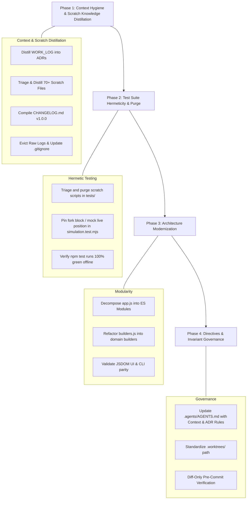

# Engineering Remediation & Agent Alignment Guide
## Modernizing the `morpho-migration` Codebase: Context Hygiene, Scratch Knowledge Distillation, Hermetic Testing, and Modular Architecture

**Target Repository:** `morpho-migration`  
**Author:** Pair-Programming AI Architecture Review  
**Date:** September 2026  
**Audience:** Autonomous & Pair-Programming AI Agents / Engineers

---

## Executive Summary

An architectural audit of `morpho-migration` against current institutional engineering standards revealed critical technical debt:

1. **Severe Context Poisoning:** A tracked, monolithic `WORK_LOG.md` (2,684 lines / 217 KB / ~55,000 tokens) alongside `HISTORY_LOG.md` and 70+ root scratch/log files floods agent context windows with obsolete, biased intermediate debugging logs.
2. **Untriaged Scratch Knowledge:** The `scratch/` directory contains 70+ files comprising decompiled Solidity bundlers, one-off market checks, and real revert traces. Deleting them blindly loses valuable domain discoveries; leaving them raw pollutes future agent context.
3. **Missing Changelog & ADR Architecture:** No `CHANGELOG.md` or `docs/adr/` exists. Critical design choices (e.g., Permit2 two-layer approvals, iterative swap debt scaling) are lost inside conversational prose.
4. **Broken & Polluted Test Suite:** Running `npm test` fails due to unpinned live mainnet state (`AssertionError: Live debt should be loaded from mainnet (> 0)`), and the `tests/` directory is cluttered with 12+ untracked scratch/debug scripts.
5. **Monolithic Architecture:** `app.js` is 2,401 lines (~100 KB) mixing DOM manipulation, state management, calculation orchestration, and simulation logic in a single file. `builders.js` is 916 lines of procedural calldata script.
6. **Git Hygiene Gaps:** Non-standard worktree paths (`agy-worktrees/` instead of `.worktrees/`), dirty working tree, and untracked trace files.

This guide provides an actionable, phase-by-phase execution blueprint with explicit remediation procedures, verification steps, and exit criteria to bring this codebase into full compliance.

---

## Remediation Roadmap



---

## Phase 1: Context De-Poisoning & Scratch Knowledge Distillation

### Objective
Permanently eliminate context bloat while extracting valuable empirical domain discoveries from `WORK_LOG.md` and `scratch/` before purging ephemeral logs.

### Step 1.1: Distill `WORK_LOG.md` into Architecture Decision Records (ADRs)
Do **NOT** simply delete `WORK_LOG.md` without distilling its valuable domain decisions. Extract the core non-obvious engineering solutions into `docs/adr/`:

1. **Create Directory:** `docs/adr/`
2. **Author ADRs adhering to standard format:**
   - `Title` & `Status` (Accepted)
   - `Context` (Problem encountered)
   - `Decision` (Technical implementation chosen)
   - `Considered & Rejected Alternatives` (Why other approaches failed)
   - `Consequences` (Trade-offs and runtime impacts)
3. **Mandatory ADRs to Extract from `WORK_LOG.md`:**
   - `docs/adr/0001-permit2-two-layer-allowances.md`: Explaining why Permit2 requires checking both the ERC20 token allowance to Permit2 *and* Permit2's internal allowance to the Morpho Bundler/Adapter.
   - `docs/adr/0002-pendle-swap-routing-and-intermediate-wrappers.md`: Explaining why swaps must target base underlying assets (`apyUSD`/`USDC`) and let Pendle Router resolve intermediate `SY`/`LP` wrappers dynamically.
   - `docs/adr/0003-iterative-scaling-for-cross-loan-debt.md`: Explaining why static oracle prices fail for cross-asset flashloan debt estimation and detailing the 2-step iterative swap quote solver.
   - `docs/adr/0004-transient-contract-leak-detection.md`: Documenting zero-balance assertions for intermediate bundlers in simulation.

---

### Step 1.2: Triage, Distill & Promote Scratch Files ("Triage, Distill, Promote, Evict")
The `scratch/` directory contains 70+ files. Do **not** delete them blindly. Triage them according to this 4-category protocol:

```mermaid
graph TD
    Raw[70+ Scratch Files] --> Triage{Triage by Category}
    
    Triage -->|A. Contract Sources (*.sol)| Contracts[1. Relocate to docs/contracts/ or src/abi/]
    Triage -->|B. Diagnostic Queries (check_*.js)| Utilities[2. Formalize into CLI tools or unit tests]
    Triage -->|C. Revert / Debug Logs (*.log)| Logs[3. Extract edge-case invariants -> Delete logs]
    Triage -->|D. Obsolete Scripts| Discard[4. Discard]
```

#### Category A: Smart Contract Reference Files (`*.sol`)
* **Files:** `Bundler3.sol`, `CoreAdapter.sol`, `GeneralAdapter1.sol`, `EthereumGeneralAdapter1.sol`.
* **Value:** Contains actual method selectors, function definitions, and execution flow of deployed Morpho Bundlers.
* **Action:**
  1. Create directory `docs/contracts/reference/`.
  2. Move these decompiled/reference Solidity files into `docs/contracts/reference/`.
  3. Extract clean ABI JSONs if needed into `src/core/abi/`.
  4. Ensure these files are documented with a brief header explaining their provenance as reference artifacts.

#### Category B: Diagnostic Queries & Checking Scripts (`check_*.js`, `calculate_*.js`)
* **Files:** `check_allowances.js`, `check_market.js`, `check_oracle.js`, `check_permit2_allowance.js`, `calculate_selectors.js`, etc.
* **Value:** Many contain precise on-chain query snippets for market state or Permit2 limits.
* **Action:**
  1. Review scripts against existing functions in `cli/blockchain-client.js`.
  2. If the logic is **already present** in `blockchain-client.js` or `cli-runner.js`: mark for deletion.
  3. If the logic is a **unique, valuable diagnostic tool**: promote it to an official CLI debugging command (e.g. `morpho-cli debug inspect-market <id>`) or place in a structured `scripts/diagnostics/` folder with proper documentation.

#### Category C: Debug Run Logs (`*.log`, `trace.log`, `simulation_payload.json`)
* **Files:** `cli_debug_run_*.log`, `trace.log`, `simulation_comparison_report.md`.
* **Value:** Historical records of simulation reverts (slippage, rounding deficit, gas limits).
* **Action:**
  1. Check whether any failure mode described in the logs is not yet documented in `docs/adr/` or protected by a test in `tests/`.
  2. If a non-obvious revert pattern is found, document it as a negative invariant or add an automated test assertion.
  3. Audit for any accidental PII (wallet addresses, private RPC keys).
  4. **Permanently delete the raw `.log` files.** Raw logs must never remain committed in the repository.

#### Category D: Redundant Scratch Files
* Any temporary output or draft script that does not provide new domain knowledge is safely removed.

---

### Step 1.3: Compile Milestone `CHANGELOG.md`
Create `CHANGELOG.md` adhering to [Keep a Changelog](https://keepachangelog.com/en/1.0.0/) and SemVer:
- Create `CHANGELOG.md` in repository root.
- Document `[1.0.0]` encompassing all stabilized features (Morpho Blue Rollover, Pendle Swap Integration, Leverage Adjustment CLI & UI, Permit2 Auto-Approvals, MEV Protection).
- Categorize entries into `### Added`, `### Changed`, `### Fixed`, and `### Security`.

---

### Step 1.4: Evict Ephemeral Artifacts & Update `.gitignore`
1. Delete tracked narrative logs and purged scratch items:
   ```bash
   git rm WORK_LOG.md HISTORY_LOG.md
   rm -f trace.log
   rm -rf scratch/
   ```
2. Update `.gitignore` to permanently prevent raw scratch and log pollution:
   ```gitignore
   # Scratch, logs and local debugging
   scratch/
   *.log
   .DS_Store
   user-wallet-raw-hex.json

   # Worktrees
   .worktrees/
   agy-worktrees/

   # Environment & Local Overrides
   .env
   .env.local
   ```

### Phase 1 Exit Criteria & Verification
* [ ] `git status` shows `WORK_LOG.md`, `HISTORY_LOG.md`, and `trace.log` removed.
* [ ] `docs/adr/` contains at least ADRs 0001 through 0004.
* [ ] Decompiled contracts preserved cleanly under `docs/contracts/reference/`.
* [ ] Useful diagnostics promoted to CLI or `scripts/diagnostics/`; redundant scripts deleted.
* [ ] `CHANGELOG.md` is present and conforms to Keep a Changelog.
* [ ] `scratch/` directory is cleared or gitignored; `*.log` files are ignored.
* [ ] Total token overhead in repo root reduced by >50,000 tokens.

---

## Phase 2: Hermetic Test Suite & Scratch Script Purge

### Objective
Restore 100% green, deterministic test runs by isolating tests from unpinned live network states and purging ad-hoc scripts from `tests/`.

### Step 2.1: Purge Ad-Hoc Scratch Scripts from `tests/`
The `tests/` folder is cluttered with ad-hoc node scripts that are not automated tests:
1. Review and clean up:
   - `check_decimals.mjs`
   - `check_market_details.mjs`
   - `check_market_hash.mjs`
   - `check_morpho_params.mjs`
   - `check_token_name.mjs`
   - `debug_allowance.js`
   - `debug_allowance.mjs`
   - `test_borrow_balance.mjs`
   - `test_pendle_swap_direct.mjs`
   - `test_permit2_transfer.mjs`
   - `trace_simulation.mjs`
2. If any script contains a useful invariant assertion, convert it into a formal test file named `*.test.mjs` and register it in `tests/package.json`. Otherwise, delete it.

### Step 2.2: Fix Live Position Fragility in `simulation.test.mjs`
**Root Cause of Current Failure:**
`simulation.test.mjs:356` asserts:
```javascript
assert(liveDebt > 0n, 'Live debt should be loaded from mainnet (> 0)');
```
It queries address `0xF0A6e66B4396a70eE0620064da847821BeE70731` against the live current Ethereum block. Because the position on mainnet has since been closed or modified, the live query returns 0 debt, breaking the test.

**Remediation:**
1. **Pin Fork Block:** Enforce `process.env.FORK_BLOCK_NUMBER` (e.g. pinned to the exact block where `0xF0A6...` held an active position).
2. **Mock or Seed Fixture:** Alternatively, mock the RPC response for `eth_call` / Morpho GraphQL for unit/simulation tests, or use a local fork cheat code (`anvil_setStorageAt` or mock provider) so the test is hermetic and does not depend on external live position persistence.
3. Ensure `tests/simulation_cross_loan.test.mjs` also adheres to pinned/mocked fixtures.

### Phase 2 Exit Criteria & Verification
* [ ] `npm test` runs from the repository root and completes with exit code 0.
* [ ] Zero untracked or scratch scripts exist in `tests/`.
* [ ] Tests run without requiring internet access for dynamic wallet state.
* [ ] All tests assert clear mathematical or behavioral invariants.

---

## Phase 3: Modular Object-Oriented Architecture Refactoring

### Objective
Deconstruct the monolithic `app.js` (2,401 lines) and `builders.js` (916 lines) into cohesive, single-responsibility ES modules with clean interfaces.

### Current Architectural Defect
* `app.js` handles:
  1. DOM element queries & event listener attachments
  2. UI state (active tab, selected markets, custom address inputs)
  3. Morpho GraphQL & RPC API calls
  4. Math calculations (LTV, collateral value, slippage parsing)
  5. Swap route fetching via Pendle API
  6. Bundler calldata assembly & simulation calls
  7. Post-execution transaction receipt parsing
* Any change in UI logic risks breaking transaction generation, and vice-versa.

### Refactored Component Blueprint

```
src/
├── core/
│   ├── math/
│   │   ├── ltv-calculator.js           # LTV, health factor, max borrow math
│   │   ├── scaling-service.js          # Multi-decimal scaling factors
│   │   └── slippage-service.js         # Basis points BigInt conversions
│   ├── builders/
│   │   ├── approval-builder.js         # ERC20 & Permit2 approvals
│   │   ├── rollover-bundle-builder.js  # Flashloan + Unwind + Swap + Supply
│   │   └── leverage-bundle-builder.js  # Leverage up / deleverage bundles
│   └── services/
│       ├── morpho-market-service.js    # Market params, positions, oracles
│       ├── swap-quoter-service.js      # Pendle / DEX aggregator route quoter
│       └── simulation-service.js       # eth_simulateV1 & trace decoding
└── ui/
    ├── state/
    │   └── ui-state-store.js           # Observable/reactive UI state container
    ├── components/
    │   ├── error-banner.js             # Visual HTML error boundary
    │   ├── market-selector.js          # Market dropdown & PT input bindings
    │   ├── position-preview.js         # Summary tables & audit metrics
    │   └── wallet-modal.js             # WalletConnect modal & status
    └── app-controller.js               # Lightweight coordinator (< 250 lines)
```

### Refactoring Rules
1. **Preserve ESM Import Compatibility:** Keep browser native ES imports (`import ... from './module.js'`). Include explicit `.js` extensions.
2. **Do Not Break JSDOM Tests:** `tests/app.test.mjs`, `tests/cli_ui.test.mjs`, and `tests/preview_workflow.test.mjs` import `app.js` in a JSDOM environment. `app.js` should serve as the clean entrypoint exporting the decomposed controllers.
3. **One Primary Unit Per File:** Each file must contain exactly one service, class, or focused module.
4. **Max Line Limit:** No module in `src/` may exceed 400 lines of code.

### Phase 3 Exit Criteria & Verification
* [ ] `app.js` is reduced to a lightweight entrypoint (<250 lines) wiring the UI controllers.
* [ ] `builders.js` is refactored into dedicated builder modules under `src/core/builders/`.
* [ ] All JSDOM tests (`app.test.mjs`, `cli_ui.test.mjs`, `preview_workflow.test.mjs`, `feature_parity.test.mjs`) pass with 0 regressions.
* [ ] CLI commands (`cli/rollover-command.js`, `cli/leverage-command.js`) share the unified `src/core/` services.

---

## Phase 4: Directives, Worktree & Governance Alignment

### Objective
Update `.agents/AGENTS.md` and project configs to permanently lock in the anti-context-poisoning standards.

### Step 4.1: Update `.agents/AGENTS.md`
Incorporate the following mandatory sections into `.agents/AGENTS.md`:
1. **Memory & Context Hygiene Directives:**
   - Explicit ban on continuous work logs or scratchpads (`WORK_LOG.md`).
   - Conventional Commits as the sole immutable chronological history.
   - Milestone-only `CHANGELOG.md` maintenance.
   - Mandatory ADR creation in `docs/adr/` for design decisions and rejected alternatives.
2. **Isolated Worktree Standard:**
   - Mandate `.worktrees/` (e.g. `.worktrees/feature-name`) instead of `agy-worktrees/` or root modifications.
3. **Hermetic Testing Invariant:**
   - Ban on unpinned live network queries in test assertions.
   - AST / Property testing for financial math functions.

### Step 4.2: Standardize Worktree Configurations
1. Remove obsolete `agy-worktrees/` directory from git tracking or working tree.
2. Add `.worktrees/` to `.gitignore`.

### Phase 4 Exit Criteria & Verification
* [ ] `.agents/AGENTS.md` contains strict Context Management, ADR, and Testing directives.
* [ ] Commit messages follow Conventional Commits format (`feat:`, `fix:`, `refactor:`, `test:`, `docs:`).
* [ ] A pre-commit diff-only review passes with zero lint, test, or invariant violations.

---

## Verification Checklist for the Executing Agent

Before declaring any remediation track complete, execute and verify:

```bash
# 1. Clean working tree and no tracked logs
git status
# Expect: No WORK_LOG.md, HISTORY_LOG.md, trace.log, or raw scratch/ files

# 2. Automated tests pass 100% green
npm test
# Expect: Exit code 0, all suites pass deterministically

# 3. ADRs exist and are properly formatted
ls -la docs/adr/
# Expect: ADR 0001, 0002, 0003, 0004 present

# 4. Reference contracts safely preserved
ls -la docs/contracts/reference/
# Expect: Bundler3.sol, CoreAdapter.sol, etc.

# 5. CHANGELOG adheres to Keep a Changelog
cat CHANGELOG.md | head -n 30
# Expect: Keep a Changelog header, [1.0.0] release section

# 6. Modularity check (no gigantic files)
find . -name "*.js" -not -path "*/node_modules/*" -exec wc -l {} + | sort -rn | head -n 10
# Expect: No file exceeds 400 lines
```
