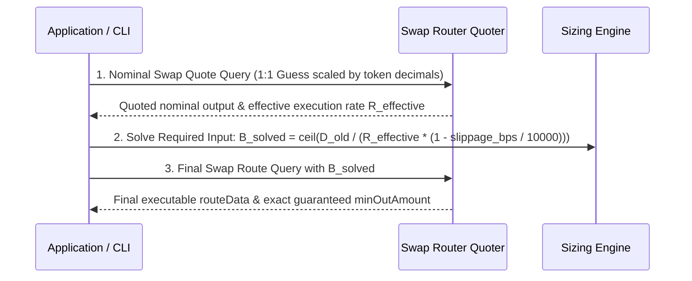

# ADR 0003: Two-Step Iterative Swap Quote Solver for Cross-Loan Flashloan Debt Estimation

- **Status:** Accepted
- **Date:** 2026-06-27
- **Deciders:** Morpho Migration Engineering Team

---

## Context

When rolling over a Morpho Blue position between markets with different loan assets (e.g. from an old market borrowing `USDC` to a new market borrowing `apyUSD`, or vice versa), the transaction utilizes a flashloan to repay the old debt atomically:
1. Flashloan old loan asset $D_{old}$ to repay and close the old debt.
2. Withdraw collateral $C_{old}$ and supply it as $C_{new}$ in the new market.
3. Borrow new loan asset $B_{new}$ from the new market.
4. Swap $B_{new}$ for $D_{old}$ via a DEX aggregator or swap router.
5. Repay the flashloan $D_{old}$ with the swap proceeds, with any surplus or deficit reconciled with the user's wallet.

To minimize user wallet capital requirements and prevent unexpected shortfall draws, the application must borrow exactly the amount $B_{new}$ such that:
$$\text{Output}(B_{new}) \times (1 - \text{slippage}) \ge D_{old}$$

### The Failure of Static Oracle Estimation
Initial implementations computed $B_{new}$ using the Morpho or Chainlink collateral/debt oracle prices:
$$B_{new} \approx D_{old} \times \frac{P_{old}}{P_{new}}$$
This approach consistently failed in production:
- **AMM Price Impact & Slippage:** Real swap routing incurs price impact, liquidity pool fees, and DEX aggregator routing splits that oracles cannot predict.
- **Oracle vs Market Price Drift:** On-chain oracles reflect smoothed, periodic TWAPs or heartbeat thresholds that diverge from instantaneous spot swap quotes.
- **Deficit Reverts:** If the static formula underestimates $B_{new}$, the swap output falls short of $D_{old}$. The transaction then tries to pull the remaining deficit from the user's wallet via Permit2. If the user's wallet has insufficient balance, the entire multicall reverts.
- **Excess Debt / Lower Health Factor:** If the static formula overestimates $B_{new}$, the user takes on unnecessary leverage and borrows more than needed.

---

## Decision

We replaced static oracle estimations with a **Two-Step Iterative Swap Quote Solver**:

### Protocol Steps:
1. **Nominal Rate Probe:** Query the swap router with a nominal input amount (e.g. 1.0 unit scaled by `10 ** tokenInDecimals`) to obtain the current real-world effective conversion rate:
   $$R_{\text{effective}} = \frac{\text{nominalOut}}{\text{nominalIn}}$$
2. **Solve Exact Input Amount:** Calculate the required borrow input $B_{\text{solved}}$ in BigInt:
   $$B_{\text{solved}} = \left\lceil \frac{D_{\text{old}} \cdot 10^{\text{decimals}_{\text{in}}} \cdot 10000}{R_{\text{effective}} \cdot (10000 - \text{slippageBps})} \right\rceil$$
3. **Fetch Final Executable Route:** Re-query the swap router using $B_{\text{solved}}$ as `amountIn` to obtain the finalized transaction calldata, guaranteed minimum output `minOutAmount`, and dynamic spender addresses.
4. **Parity:** This exact solver workflow is implemented identically in both the CLI (`cli/rollover-command.js`, `cli/leverage-command.js`) and the Web UI controller (`app.js`).

---

## Considered & Rejected Alternatives

1. **Collateral Oracle Ratio Formula:**
   - *Why Rejected:* Failed systematically. Yielded frequent swap shortfalls resulting in Permit2 wallet pulls and transaction reverts for users without liquid wallet balances.

2. **Fixed Percentage Buffer Addition (e.g. +3% borrow amount):**
   - *Why Rejected:* Artificially inflates borrower leverage, reduces liquidation buffer (LLTV margin), and leaves unneeded loan asset dust that must be returned to the wallet.

3. **Multi-iteration Binary Search Quoting:**
   - *Why Rejected:* Making 5-10 sequential HTTP requests to the swap router introduces 5-10 seconds of latency and risks hitting API rate limits. Because stablecoin and PT swaps have tight linear pricing curves around the target size, a 2-step solve is sufficient to achieve <0.01% precision without extra latency.

---

## Consequences

### Positive
- Completely eliminates swap deficit reverts during cross-loan asset rollovers and leverage adjustments.
- Guarantees zero-capital rollovers for users who have sufficient collateral margin in the new market.
- Preserves native BigInt precision across multi-decimal token pairs (e.g., 6-decimal USDC to 18-decimal apyUSD).

### Negative / Trade-offs
- Requires two sequential swap quote network queries during the preparation phase before assembling calldata.
